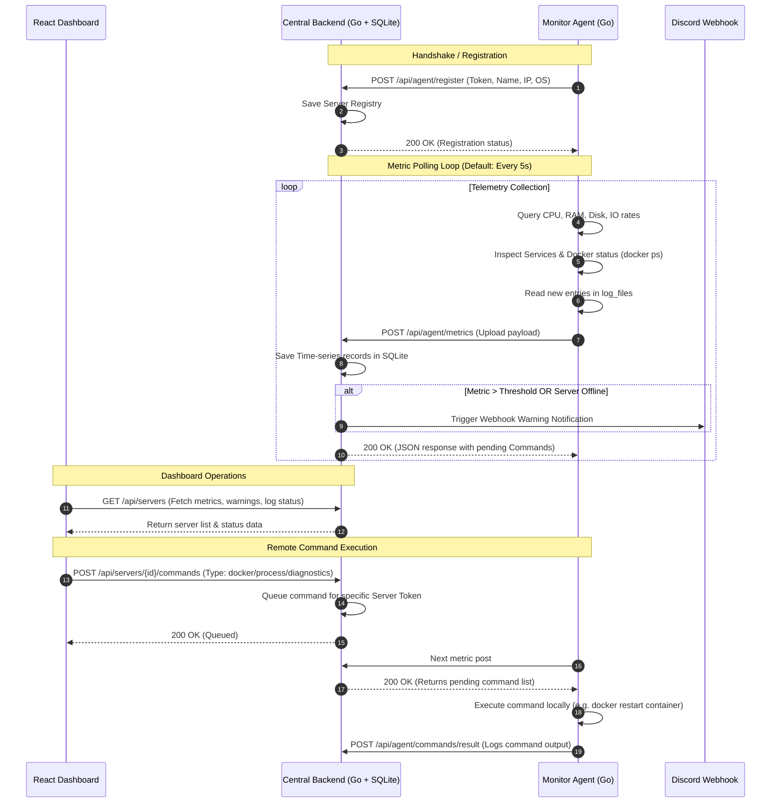

# 🖥️ ServerStatika

ServerStatika is a modern, lightweight infrastructure monitoring system designed with an **Agent-Based Architecture**. It features a lightweight Go agent running on target servers that collects resource utilization metrics (CPU, RAM, Disk, Network/Disk IO speeds, local TCP services, Docker containers, and logs) and streams them to a central Go + SQLite server. The statistics are stored in a time-series format and presented on a premium, responsive React dashboard featuring dark mode and glassmorphism styling.

---

## 🏗️ System Architecture & Diagnostic Diagram

ServerStatika consists of three primary components:
1. **Monitor Agent (`/agent`)**: A lightweight Go binary running on target hosts that queries system states, network interfaces, log files, and Docker containers, reporting telemetry and executing queued remote commands.
2. **Central Backend (`/backend`)**: A Go web server that processes agent data, tracks server health thresholds, routes notification alarms to Discord, databases metrics in SQLite, queues agent commands, and embeds the compiled dashboard.
3. **Web Dashboard (`/dashboard`)**: A modern React-based application showcasing metrics through pure SVG charts, giving administrative control to kill processes, control Docker containers, run live diagnostics, and view tail logs.

### Operational Sequence Flow



---

## 🐋 Docker Container Status Checker & Controller

ServerStatika has a built-in checker to monitor and manage Docker environments. The agent communicates with the host's Docker daemon via command execution to provide real-time updates and interactive controls on the UI:

### How it Works
1. **Container Querying**: Every tick, the agent runs `docker ps --format "{{json .}}"` asynchronously with a 2-second timeout to collect active container metadata, including:
   - **ID** & **Name**
   - **Image**
   - **State** (e.g., `running`, `exited`)
   - **Status** (e.g., `Up 4 hours`)
2. **Container Telemetry**: The status list is attached to the metrics payload and visualized in the **Docker Containers** table on the React dashboard.
3. **Interactive Control & Command Execution**:
   - Authorized users can trigger container lifecycle actions from the web dashboard: **Start**, **Stop**, or **Restart**.
   - These actions are sent as payloads to the backend queue and executed by the agent via `docker [action] [container_id]`.
   - The execution logs are immediately posted back to the server to verify command completion.

---

## ⚙️ Quickstart & Setup Guide

### 1. Compile the React Dashboard
The backend server uses Go's `embed` package to serve the compiled frontend directly from memory. Thus, the React app must be built first:

```bash
# Navigate to dashboard directory
cd dashboard

# Install packages
npm install

# Build static assets (vite outputs directly to ../backend/dist)
npm run build
```

### 2. Start the Central Backend Server
The backend initiates the SQLite server and hosts the dashboard on port `8080` by default.

```bash
# Navigate to backend directory
cd ../backend

# Start Go backend
go run .
```
> 🌐 **Dashboard Access**: Open your browser and navigate to `http://localhost:8080` to view the ServerStatika console.

### 3. Launch the Monitor Agent
The agent runs on the servers you wish to monitor.

1. Configure connection settings in `agent/config.json`:
   ```json
   {
     "server_url": "http://localhost:8080",
     "server_token": "srv_my_production_server",
     "server_name": "Production Server 01",
     "interval_sec": 5,
     "services": ["Nginx:80", "Postgres:5432"],
     "log_files": ["/var/log/nginx/error.log"]
   }
   ```
2. Start the agent:
   ```bash
   # Navigate to agent directory
   cd ../agent

   # Run Go agent
   go run .
   ```

---

## 🚨 Discord Alert System
The backend tracks CPU, RAM, and Disk space against set thresholds (default `90%`). If a threshold is crossed, or if an agent stops posting metrics for over 15 seconds, a Discord notification is pushed.

To enable alerts, set the `DISCORD_WEBHOOK_URL` environment variable:

*   **Windows (PowerShell)**:
    ```powershell
    $env:DISCORD_WEBHOOK_URL="https://discord.com/api/webhooks/your_id/your_token"
    go run .
    ```
*   **Linux / macOS**:
    ```bash
    export DISCORD_WEBHOOK_URL="https://discord.com/api/webhooks/your_id/your_token"
    go run .
    ```

---

## 🔗 Website Integration Guidelines

You can integrate ServerStatika metrics and status updates directly into other websites, blogs, or internal administrative panels.

### Option A: Iframe Embedding
Embed the pre-built ServerStatika web panel inside a page on another website.

```html
<iframe 
  src="http://localhost:8080/servers" 
  width="100%" 
  height="700px" 
  style="border: 1px solid rgba(255, 255, 255, 0.1); border-radius: 8px;"
  title="ServerStatika Monitor">
</iframe>
```

---

### Option B: REST API Querying (Custom Frontend)
You can request telemetry data directly from the ServerStatika API to build custom status indicators, public badges, or charts on your main site.

#### 1. Fetching Server List & Online Status
`GET http://localhost:8080/api/servers`

**Response Example:**
```json
[
  {
    "id": 1,
    "token": "srv_my_production_server",
    "name": "Production Server 01",
    "ip_address": "192.168.1.50",
    "os": "linux amd64",
    "last_seen": "2026-07-01T15:50:00Z",
    "status": "online",
    "cpu_threshold": 90,
    "ram_threshold": 90,
    "disk_threshold": 90
  }
]
```

#### 2. Fetching Historic Metrics
`GET http://localhost:8080/api/servers/{id}/metrics?limit=10`

**Response Example:**
```json
[
  {
    "id": 124,
    "server_id": 1,
    "timestamp": "2026-07-01T15:52:00Z",
    "cpu_usage_percent": 14.5,
    "ram_used_mb": 4096,
    "ram_total_mb": 16384,
    "ram_percent": 25.0,
    "disk_used_gb": 45,
    "disk_total_gb": 240,
    "disk_percent": 18.75,
    "net_sent_bytes_sec": 10240,
    "net_recv_bytes_sec": 84500,
    "disk_read_bytes_sec": 512,
    "disk_write_bytes_sec": 1024
  }
]
```

#### JavaScript Example Integration:
Use this script to add an uptime/status badge to your website:
```javascript
async function fetchServerStatus() {
  try {
    const response = await fetch('http://localhost:8080/api/servers');
    const servers = await response.json();
    const server = servers.find(s => s.token === 'srv_my_production_server');
    
    const badge = document.getElementById('server-badge');
    if (server && server.status === 'online') {
      badge.textContent = '🟢 Server Online';
      badge.style.color = '#10B981';
    } else {
      badge.textContent = '🔴 Server Offline';
      badge.style.color = '#EF4444';
    }
  } catch (error) {
    console.error('Failed to load server stats:', error);
  }
}
```

---

### Option C: Website/Port Monitoring (Uptime Checks)
The system lets you monitor external HTTP endpoints or TCP services directly. The monitor agent will verify connection state and report it as `active` or `inactive`.

Add websites, domains, or databases to the `services` array inside the agent's `config.json`:
```json
{
  "services": [
    "My Main Web:80",
    "Secure API Endpoint:443",
    "Database Node:5432"
  ]
}
```
The agent tries to establish a connection to the specified ports under the hood. The results are aggregated, sent to the central backend, and rendered in the dashboard as health indicators.

---

## 🛠️ Stack & Libraries
*   **Go Agent**: `github.com/shirou/gopsutil/v3` for platform-agnostic hardware telemetry.
*   **Central API**: pure Go (v1.22+) routing multiplexer, `modernc.org/sqlite` (Pure Go driver - no CGO required).
*   **Dashboard**: React (Vite-powered SPA), Lucide React (vector iconography), custom CSS layout with custom SVG-rendered charts.
